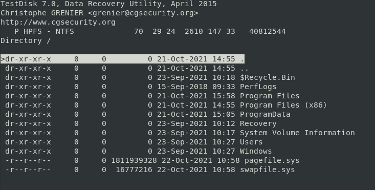
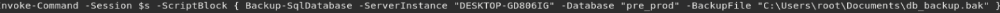
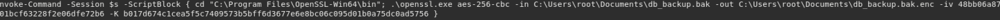
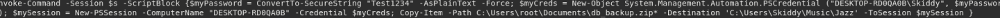
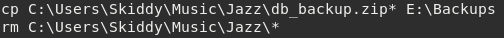
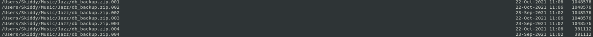

# iDisk
#### Forensic sur une image disque

_Énoncé : Il y a quelque temps, l'entreprise ECORP a constaté une intrusion au sein de son système d'information. Les équipes d'administrateurs système ont remarqué que des sauvegardes de la base de données "pre\_prod" ont été effectuées à plusieurs reprises (et sans accord au préalable) aux alentours de 00h chaque jour. Après une longue enquête policière, un suspect (ex-employé d'ECORP) a été interpelé avec un ordinateur. Toutefois, la police étant en sous-effectif, nous avons besoin de votre aide afin de mener une investigation numérique sur la machine saisie. Êtes-vous prêt à accepter cette mission ?_

Une fichier .tar.gz de 12GB nous est donné. Il contient un fichier .dd de plus de 20GB (ça fait beaucoup). Le premier réflexe est d'ouvrir ce fichier avec testdisk. On y découvre alors une partition sur laquelle est installée Windows :



On fouille alors longtemps dans les dossiers de l'utilisateur Skiddy, dans ses Documents, ses Téléchargements, ses fichiers temporaires, etc... Malgré des documents suspects, on ne trouve rien d'intéressant.

En relisant l'énoncé, on tombe sur un mot-clé important : le nom de la base de données "pre_prod". On décide alors d'utiliser la commande ```grep``` pour essayer d'en apprendre d'avantage sur cette base de données, et on tombe sur cette ligne :



On utilise à nouveau la commande ```grep``` mais en cherchant cette fois-ci "db_backup.bak" pour essayer de récupérer le contenu du backup, on tombe sur cette ligne :



L'employé a donc chiffré le backup, et nous avons la clé et le vecteur d'initialisation.
On tombe aussi sur cette ligne :


L'employé a aussi zippé le backup chiffré.

On recommence à utilister grep, en cherchant maintenant le nom du fichier .zip, "db_backup.zip", et on trouve :



L'employé a donc copié le fichier .zip dans son dossier \Music\Jazz. On s'empresse d'aller chercher dans ce dossier grâce à testdisk mais rien... Il n'y a aucun fichier.
On cherchant le mot Jazz grâce à ```grep```, on tombe sur les deux lignes suivantes :



L'employé a donc copié les fichiers .zip (La commande utilisée pour zipper le fichier a séparé le fichier en plusieurs parties) sur un disque externe puis a supprimé les fichiers, c'est pour ça qu'il n'y a rien dans \Music\Jazz.

Il est possible, grâce à testdisk, de récupérer les fichiers supprimés, toujours présents dans la mémoire de l'ordinateur. On cherche alors si nos fichiers db_backup.zip* s'y trouvent :



Bingo ! Ils y sont. On s'empresse de les extraire et de les concaténer pour avoir le fichier .zip original, que l'on peut décompresser.
Le fichier que l'on obtient est chiffré, mais nous avons toutes les informations qu'il nous faut pour pouvoir récupérer le fichier en clair. On obtient le backup grâce à la commande : 
```openssl aes-256-cbc -d -in db_backup.bak.enc -out db_backup.dec -iv 48bb06a87601bcf63228f2e06dfe72b6 -K b017d674c1cea5f5c7409573b5bff6d3677e6e8bc06c095d01b0a75dc0ad5756```.

Il nous suffit alors d'utiliser la commande ```strings``` et nous voyons le flag apparaître, vers la fin du fichier.

**FLAG** : DGA{95ecd8f47dc647599e9d1f7a90974a997338cd48}
