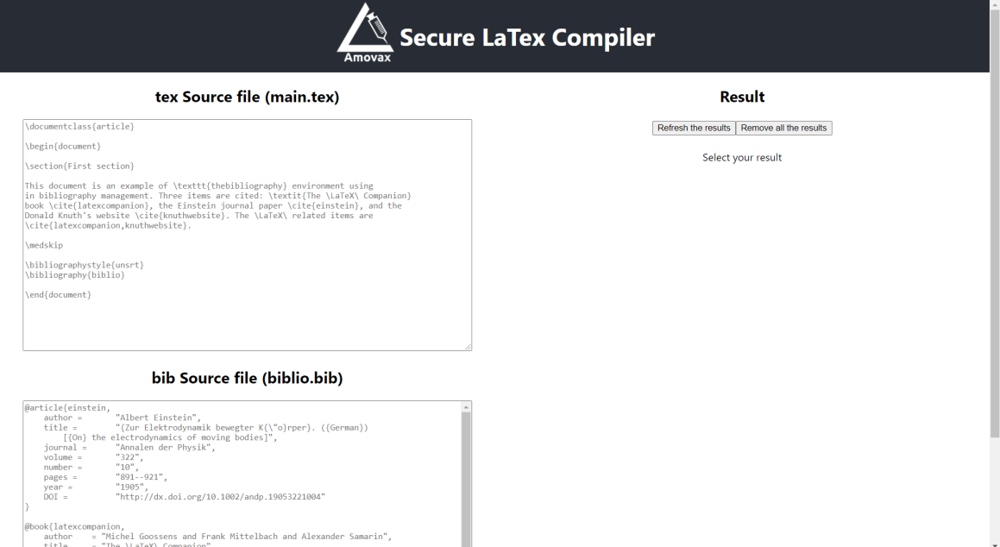

# Amovax
#### Exploitation Latex

Énoncé : Amovax is a successful pharmaceutical company with many top secret vaccine formulas.
The company's Latex compilation server is available at https://amovax.challenge-ecw.fr/.
Researchers use this server to compile their articles and to put the company's logo on the cover of the generated pdf.
Amovax stores its secrets in the /tmp/secret/ directory of this server.
The best experts of Amovax have secured this server in order to make sure that these secrets can not be exfiltrated.
Will you manage to get them?

Voici à quoi ressemble le site d'Amovax : 

On essaie d'utiliser les traditionnels ```\input```, ```\include``` et ```\immediate\write18``` mais ces commandes sont bloquées par un filtre. En faisant quelques recherches sur Internet, on se rend compte que l'on peut changer la catégorie d'un caractère grâce à la commande ```\catcode```. La catégorie d'un caractère est utilisée par le compilateur afin de savoir quoi faire lorsque ce caractère est rencontré. On apprend aussi que la catégorie des caractères d'échappement ( escape characters ), comme ```\```,  a le code ```0```. On écrit alors un [script](file.tex) qui change la catégorie d'un caractère (```X```) afin qu'il serve de caractère d'échappement. On écrit ainsi ```XimmediateXwrite18```, ce qui passe les filtres et nous permet ainsi d'exécuter les commandes ```ls /tmp/secret``` puis de récupérer le flag dans le pdf généré par le site.

**FLAG** : ECW1bbdff6ec3169d3ed24efdd78ba8d987
