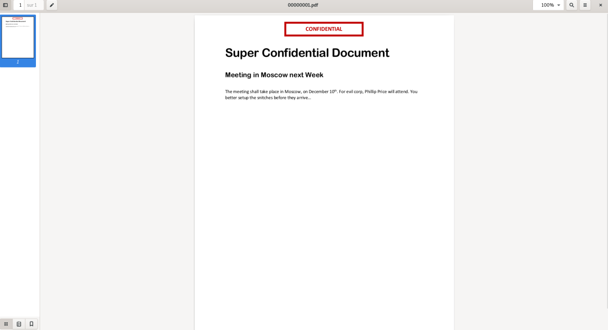

# Nighty Planet
#### Forensic capture réseau

### Étape n°1

**Énoncé** : _The Nightly Planet is a famous Gotham NewsPaper. Its redaction team has noticed suspicious activity on their computers, and require your help to find out what happened, and lead the investigation!
They have provided you with a network capture taken on their main server. Can you discover all the steps of the attack?_

Un fichier .pcapng nous est donné, on l'ouvre avec Wireshark et l'on observe qu'il y a des centaines de flux TCP. En ce balandant dans ces flux, on observe à un moment ce qui correspond à une injection SQL, à partir du flux n°13: 
``` GET /MonSuperCMS/Public/articles.php?id=1'%20AND%20(length((select%20password%20FROM%20users%20LIMIT%200,1)))%20=%201%20AND%20'1'='1 HTTP/1.1\r\n```
Cette requête sert à connaître la taille du mot de passe du premier utilisateur dans la table users, qui correspond sûrement à l'administrateur. La taille ne nous intéresse pas trop étant donné que nous connaissons le format du flag. Après plusieurs requête de ce style, on trouve, à partir du flux n°45, une autre forme de requête :
```GET /MonSuperCMS/Public/articles.php?id=1'%20AND%20(ASCII(SUBSTR((SELECT%20password%20FROM%20users%20LIMIT%200,1),1,1)))%20=%2032%20AND%20'1'='1 HTTP/1.1\r\n```
Et on observe sur les suivantes :
```GET /MonSuperCMS/Public/articles.php?id=1'%20AND%20(ASCII(SUBSTR((SELECT%20password%20FROM%20users%20LIMIT%200,1),1,1)))%20=%2033%20AND%20'1'='1 HTTP/1.1\r\n```
```GET /MonSuperCMS/Public/articles.php?id=1'%20AND%20(ASCII(SUBSTR((SELECT%20password%20FROM%20users%20LIMIT%200,1),1,1)))%20=%2034%20AND%20'1'='1 HTTP/1.1\r\n```

Il s'agit d'une Boolean based SQL Injection. L'attaquant envoie une série de requêtes SQL pour chaque caractère du mot de passe. Ces requêtes comparent le caractère courant avec une valeure ASCII (l'attaquant commence à 32) qui est incrémentée à chaque requête. Lorsque la requête passe, l'attaquant sait à quoi correspond le caractère courant et passe ainsi au caractère suivant. Ainsi, on a juste à récupérer le dernier code ASCII avec lequel le caractère a été comparé pour connaître la valeur du caractère courant. On passe ainsi sur toutes les requêtes grâce à Wireshark et on obtient le flag.

**Flag** : ECW1{AlwaysThatBooleanBasedSQLi}

### Étape n°2

L'étape n°2 se trouve sur le même fichier. Après les centaines de requêtes de la SQL Injection, on trouve un flux contenant une requête POST :
```POST /MonSuperCMS/Intranet/upload.php HTTP/1.1```

Le fichier uploadé est un pdf que l'on s'empresse de récupérer : 

Il n'y a rien d'intéressant, on utilise ```strings``` sur le pdf et on observe les lignes suivantes : 
```/S /JavaScript```
```/JS <6170702E616C65727428224F6F70732021204E6F7468696E6720746F20736565206865726522293B0A2F2F57656C6C20446F6E652021204465636F64652074686520666F6C6C6F77696E6720737472696E672066726F6D2062617365363420746F206765742074686520326E6420666C61670A2F2F2052554E584D6E744E5957787059326C7664584E5152455A42636D565464476C736245465561476C755A7A39390A>```

Il y a donc du code javascript dans le pdf, encodé en hexadécimal :
```js
app.alert("Oops ! Nothing to see here");
//Well Done ! Decode the following string from base64 to get the 2nd flag
// RUNXMntNYWxpY2lvdXNQREZBcmVTdGlsbEFUaGluZz99
```
Il ne reste plus qu'à décoder la base 64.

**Flag** : ECW2{MaliciousPDFAreStillAThing?}