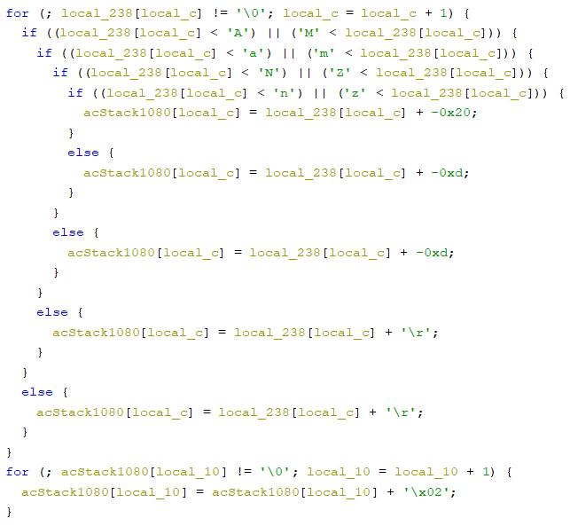
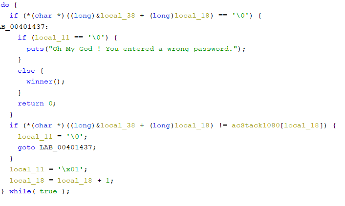

# Knight Switch Bank
### Reverse engineering

_I have forgot my Knight Switch Bank password. Can you please retrive the password for me ?_

The binary is a ELF 64-bit, not stripped. First, we want to know what does the binary, and for that we use Ghidra to decompile it. We look at main function's pseudocode and we can see few intersting things : 

First, out input is modified in this code :



The binary takes our input char by char and does the following operation :
If the char is between 'A' and 'M' or between 'a' and 'm', the binary adds 0xd (13) to the char.
Else if the char is between 'N' and 'Z' or between 'n' and 'z', the binary substracts 0xd (13) to the char.
Else, the binary substracts 0x20 (32) to the char.
And finally, for all the chars modified before, the binary adds 0x2 to it.

After that, the binary compares each char with a set of chars from the binary itself :



local_38 on the screenshot corresponds to the following string : "ZRIU]HdANdJAGDIAxIAvDDsAyDDq_"

Now, we have all the informations to get the flag. In fact, the operations made in the first part are just a rot13 cipher. The letter will be substituted by the 13th letter after it. For example, a "A" will become a "N", and a "P" will become a "C". And when the char is not a letter, the binary just substracts 0x20 to it.

I wrote this little script to get the flag :

```python
compare = "ZRIU]HdANdJAGDIAxIAvDDsAyDDq_"
first_compute = ""

for i in compare:
    first_compute += chr(ord(i) - 0x02)

second_compute = first_compute.encode('rot13')
flag = ""

for i in second_compute:
    if (ord(i) < 0x41 or (ord(i) > 0x5a and ord(i) < 0x61) or ord(i) > 0x7a):
        flag += chr(ord(i) + 0x20)
    else:
        flag += i

print(flag)
```

We must not forget that all of the chars are added by two just before the comparison.

**FLAG** : KCTF{So_YoU_ROT_iT_gOOd_jOOb}
    
